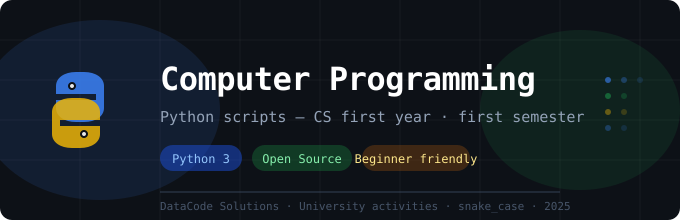

# 🐍 Computer Programming — CS First Year

Practical activities developed during the **Computer Programming** course,
first semester of Computer Science at university.

Each folder contains one practical activity with its Python scripts,
organized chronologically to track my learning progress.

---

## 📁 Repository Structure

```
📦 computer-programming
├── 📂 activity_1/
│   ├── temperature_converter.py
│   └── factorial_calculator.py
├── 📂 activity_2/
│   └── inventory_management.py
└── README.md
```

---

## 📌 Activities

### Activity 1 — Calculation Utilities
> Two independent Python scripts focused on numeric data types, casting, built-in libraries, and formatted output.

| Script | Description |
|---|---|
| `temperature_converter.py` | Converts a temperature from Celsius to Fahrenheit using `float` casting and f-strings |
| `factorial_calculator.py` | Calculates the factorial of an integer using Python's `math` library |

**Concepts covered:**
- `input()` and explicit type casting (`float`, `int`)
- Mathematical operators and operator precedence
- `import` and use of native libraries (`math`)
- Formatted output with f-strings

---

### Activity 2 — Inventory Management System
> An interactive inventory system built with a `while` loop, dictionaries, functions, and basic error handling.

| Script | Description |
|---|---|
| `inventory_management.py` | Simulates a product stock system with an interactive menu |

**Concepts covered:**
- Dictionary of Dictionaries as a data structure
- `while` loop for interactive menus
- Functions (`def`) for modular code organization
- Conditional structures (`if`, `elif`, `else`)
- Basic input validation and error handling

---

## 🛠️ How to Run

Make sure you have **Python 3** installed.

```bash
# Clone the repository
git clone https://github.com/your-username/computer-programming.git

# Navigate to the desired activity
cd computer-programming/activity_1

# Run a script
python3 temperature_converter.py
```

---

## 👨‍💻 About

Developed as part of the academic curriculum for the Computer Science degree.
All scripts are written in **Python 3** following `snake_case` naming conventions.
